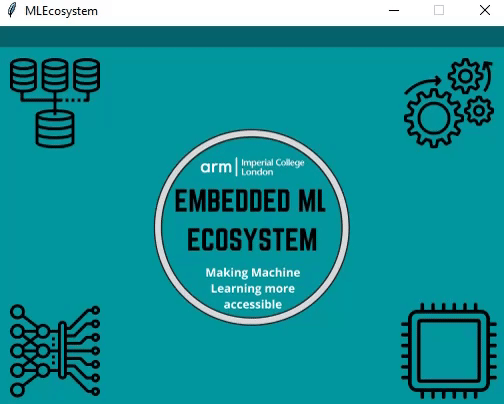
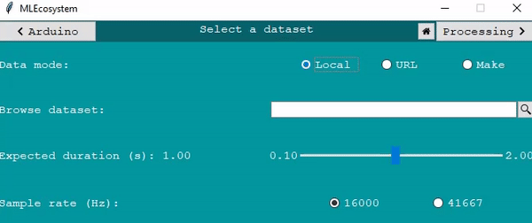
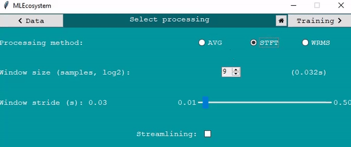
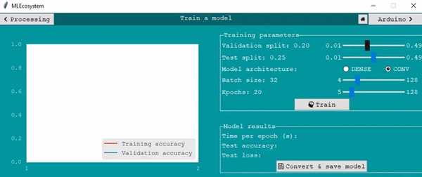
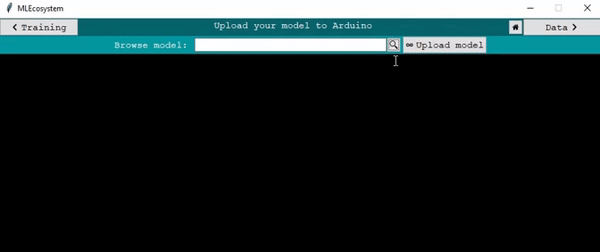

# EMILY

Embedded Machine Learning Ecosystem (EMLE -> EMILY) is an intuitive, beginner-friendly platform aimed at simplifying the creation and deployment of machine learning models on embedded devices.

Our simple, easy-to-use User Interface (UI) guides the user through the entire pipeline required for constructing an audio classifier and deploying it to a microcontroller. This includes:

- selecting a dataset,
- choosing and tuning an audio processing method,
- configuring ML-related parameters for the model training,
- directly uploading their models to Arduino for running inference (without the need for manual steps in the Arduino IDE).

Our application is an all-in-one package.


## How to run:

### Python:
Run the main.py python script from the UI folder.

__Requirements:__ For this project we only require that Python (3.9) and PIP are installed. After this please run ```pip install -r requirements.txt``` using the requirements.txt file of the repository. This will automatically install all other packages used in the project.

If you want you can use a virtual environment and install the requirements there (```pip install virtualenv```).

Tested Operating Systems: Windows 10, Linux, MacOS.

Tested Arduino Boards: [Arduino Nano 33 BLE Sense](https://store.arduino.cc/arduino-nano-33-ble-sense)

<br/><br/>

### Executable (users: ignore this for now):
Download / Clone this repo and make sure you have the above requirements installed.

Open the ```emily.spec``` file and change the ```pathex``` to the root directory of the project.

In the same file, change line 24 such that the first argument of the tuple is the path to your local ```\\librosa\\util\\example_data```.

Open terminal at the root of the project and type the following:

```pip install pyinstaller```

```pyinstaller emily.spec```

If you face any issues with the above, run terminal as admin.
If all goes well you should have an executable within the dist folder generated by the above command.

<br/><br/>

## Repository breakdown + Usage Examples:

1. **main.py:** Main UI frontend file. Everything from the backend is called from here. (the gif shown is the UI home page)

<p align="center">
  
</p>


---

2. **scripts (folder):** Contains all scripts that form the backend, and is divided further into four folders which represent the four blocks in the pipeline:

   1. **dataset:** Contains everything related to accessing and loading the audio dataset. Achieves the following:
      1. Choose the source of the dataset. Options: load from local directory, download from URL, create dataset within our UI
      2. Set important dataset parameters, such as the expected track duration and the sampling rate

   <p align="center">
     
   </p>

   ---


   3. **processing:** Contains everything related to preprocessing the audio dataset. Achieves the following:
      1. Choose the signal processing method. Options: Averaging, Short Time Fourier Transform, Windowed Root Mean Square
      2. Configure processing by tuning algorithm parameters
      3. Option to streamline the input pipeline

   <p align="center">
     
   </p>

   ---

   5. **training:** Contains everything related to training, converting, and saving the model. Achieves the following:
      1. Set various ML-related parameters
      2. Choose between Convolutional and Dense models.
      3. Real-time plotting of model performance
      4. Model quantization and quantization-aware training
      5. Convert model to form readable by the microcontroller and save it in user-selected destination

   <p align="center">
     
   </p>

   ---

   7. **arduino:** Contains everything related to deploying the arduino script as well as the model chosen for inference. Achieves the following:
      1. Compile and upload ready-made Arduino script for preprocessing and inference.
      2. Pass dataset and processing parameters to Arduino through the model file.
      3. Automated deployment to microcontroller through  Arduino-CLI.
      4. Live feedback from the CLI through a custom CMD.

   <p align="center">
     
   </p>

   ---
3. **arduino_inference_script (folder):** Contains the following files:

   1. Arduino script implementing the Arduino-side pipeline. This includes audio reception from the on-board microphone, audio signal processing, as well as inference using the uploaded model file.
   2. A header (.h) file containing the model chosen for upload as well as other dataset and processing parameters that need to be communicated to the Arduino.
4. **arduino_recording_script (folder):** Arduino script uploaded for recording a dataset from within the UI, since we utilize the arduino microphone.

---

5. **imports.py:** Contains all imports currently used.
6. **Images (folder):** Contains images used as icons within the UI.
7. **requirements.txt:** Contains all packages used in the project, used for installing allof them at the same time using PIP (see How to run section).
8. **UI_gifs:** Contains GIFs of the UI in operation used in the README.

## Authors:

- Andreas Floros
- Bharat Kumar
- Hussain Kurabadwala
- Vasileios Manginas
- Stacey Wu

### Acknowledgments:

ARM Team:

- Henri Woodcock
- Sandeep Mistry

Project supervisor (Imperial College London):

- Dr. Krystian Mikolajczyk
